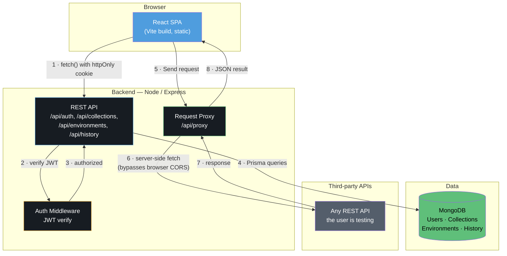
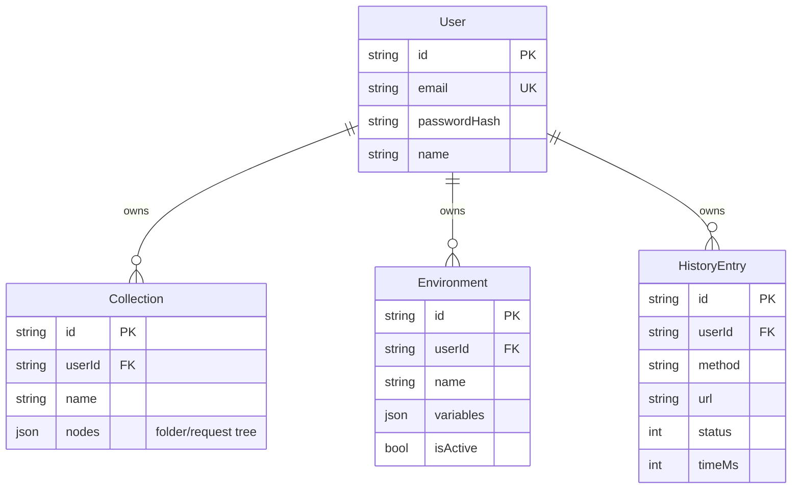

<div align="center">

# ⚓ Anchor

**A git-native API client. Local collections, cloud sync, no lock-in.**

[Overview](#overview) • [Architecture](#architecture) • [Setup](#setup) • [API Reference](#api-reference) • [Deployment](#deployment) • [Roadmap](#roadmap--known-limitations)

</div>

---

## Overview

Anchor is a lightweight alternative to Postman, built around one idea: **your API
collections are your data, not a vendor's**. They sync to your account for
convenience, but they can be exported and diffed like code at any time — no forced
proprietary format, no cloud lock-in for something as simple as a saved request.

| | |
|---|---|
| **Status** | Functional prototype — hardened against common backend attack surfaces, not yet deployed or load-tested |
| **Frontend** | React 19 · TypeScript · Vite · Tailwind CSS v4 · Framer Motion |
| **Backend** | Express · TypeScript · Prisma (MongoDB) · JWT auth |
| **CI/CD** | Not yet configured — see [Roadmap](#roadmap--known-limitations) |

---

## Architecture



**Why the proxy step matters:** a browser calling a third-party API directly hits
CORS on almost everything. Steps 5–8 exist so the actual HTTP call happens
server-side — the same reason Postman ships a desktop app instead of being a
website.

### Data model



Collections store their folder/request tree as a single JSON document rather than
normalized rows — it's read and written as one unit (open a collection, edit a
request, save), so this avoids N+1 queries for a structure that's naturally
tree-shaped.

---

## Project structure

```
anchor-fullstack/
├── docker-compose.yml        # Local MongoDB (single-node replica set)
├── frontend/
│   ├── src/
│   │   ├── components/       # Sidebar, RequestPanel, ResponsePanel, AuthScreen…
│   │   ├── lib/
│   │   │   ├── api.ts        # Backend API client
│   │   │   ├── execute.ts    # Request execution via the proxy
│   │   │   └── exportSnapshot.ts
│   │   ├── store.ts          # Zustand — auth + workspace state
│   │   └── types.ts
│   └── vercel.json
└── backend/
    ├── prisma/schema.prisma  # MongoDB models
    └── src/
        ├── routes/           # auth, collections, environments, history, proxy
        ├── middleware/auth.ts
        └── lib/{db,jwt}.ts
```

---

## Setup

### Prerequisites

- Node.js 20+
- Docker (for local MongoDB) — or a [MongoDB Atlas](https://www.mongodb.com/atlas) connection string

### 1 · Database

```bash
docker compose up -d
```

Starts MongoDB on `localhost:27017` as a single-node replica set. This isn't
optional — Prisma's transactions (used when switching active environments) require
a replica set even locally, and a bare `mongod` will throw at runtime without it.

### 2 · Backend

```bash
cd backend
cp .env.example .env        # then set a real JWT_SECRET — `openssl rand -base64 32`
npm install
npx prisma generate         # downloads Prisma's query engine — needs real internet access
npx prisma db push          # creates collections & indexes from schema.prisma
npx tsc --noEmit             # verify before trusting it
npm run dev                  # → http://localhost:4000
```

### 3 · Frontend

```bash
cd frontend
cp .env.example .env        # VITE_API_URL defaults to localhost:4000, fine for local dev
npm install
npm run dev                  # → http://localhost:5173
```

Open `http://localhost:5173`, create an account, start building requests.

---

## Environment variables

**`backend/.env`**

| Variable | Required | Description |
|---|---|---|
| `DATABASE_URL` | ✅ | MongoDB connection string. Must point at a replica set. |
| `JWT_SECRET` | ✅ | Random secret signing session tokens. Never reuse the example value. |
| `PORT` | – | Defaults to `4000`. |
| `CLIENT_ORIGIN` | ✅ | Exact frontend URL, for CORS + cookies. Must include the scheme. |
| `NODE_ENV` | – | `development` or `production`. |

**`frontend/.env`**

| Variable | Required | Description |
|---|---|---|
| `VITE_API_URL` | ✅ | Backend base URL. Baked in at **build time**, not runtime. |

---

## API reference

All routes are prefixed `/api`. Authenticated routes read the session from an
httpOnly cookie set at login (or `Authorization: Bearer <token>` as a fallback).

| Method | Path | Auth | Description |
|---|---|---|---|
| `POST` | `/auth/register` | – | Create an account |
| `POST` | `/auth/login` | – | Sign in |
| `POST` | `/auth/logout` | – | Clear session |
| `GET` | `/auth/me` | ✅ | Current user |
| `GET` | `/collections` | ✅ | List collections |
| `POST` | `/collections` | ✅ | Create a collection |
| `PATCH` | `/collections/:id` | ✅ | Update name/nodes |
| `DELETE` | `/collections/:id` | ✅ | Delete a collection |
| `GET` | `/environments` | ✅ | List environments |
| `POST` | `/environments` | ✅ | Create an environment |
| `PATCH` | `/environments/:id` | ✅ | Update name/variables |
| `POST` | `/environments/:id/activate` | ✅ | Set as active |
| `DELETE` | `/environments/:id` | ✅ | Delete an environment |
| `GET` | `/history` | ✅ | Last 100 requests |
| `POST` | `/history` | ✅ | Log a request |
| `POST` | `/proxy` | ✅ | Execute a request server-side |

---

## Deployment

**Backend** (needs a real Node process — Railway or Render):
1. Provision MongoDB Atlas (free tier is enough to start)
2. Set `DATABASE_URL`, `JWT_SECRET`, `CLIENT_ORIGIN`, `NODE_ENV=production`
3. Build: `npm install && npm run build` · Start: `npm start`
4. Run `npx prisma db push` once against production `DATABASE_URL` before first boot

**Frontend** (static — Vercel or Netlify):
1. Set `VITE_API_URL` to the deployed backend URL
2. `vercel.json` already includes the SPA rewrite

> Deploy the backend **first**. `VITE_API_URL` is compiled into the frontend bundle
> at build time, not read at runtime — deploying frontend first means it ships
> pointing at nothing.

---

## Security notes

- Passwords hashed with bcrypt, never stored or logged in plaintext
- Sessions are httpOnly cookies — not readable by client-side JS, mitigating XSS token theft
- The proxy blocks requests to loopback and private IP ranges (basic SSRF guard)
- See [Roadmap](#roadmap--known-limitations) for what's *not* covered yet — rate
  limiting, CSRF, and DNS-rebinding protection are gaps, not oversights I'm hiding

---

## Roadmap / known limitations

**Not yet hardened** (in progress):
Rate limiting, CSRF protection, DNS-rebinding-resistant SSRF checks, account
deletion, structured logging, error tracking, real `/health` DB check.

**Not built** (product decisions, not defects):
Test/pre-request scripts, mock servers, team workspaces, multipart file uploads,
GraphQL/WebSocket support, API doc generation.

**Not done** (process, not code):
No CI/CD pipeline, no automated backups, no uptime monitoring, no real-world usage
yet.

---

## Tech

**Frontend** — React 19, TypeScript, Vite, Tailwind CSS v4, Framer Motion, Zustand, Lucide icons.
**Backend** — Express, TypeScript, Prisma (MongoDB), JWT (httpOnly cookies), Zod, bcrypt.

## License

Unlicensed — add one before you consider distributing this publicly.